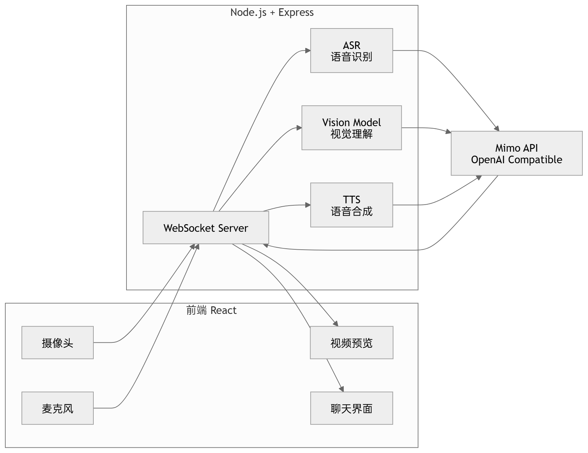

# Rui - AI 视觉对话助手 - 设计文档

> 项目背景:
>
> XEngineer第四批 选题一：AI 视觉对话助手
>
> 开发一款与 AI 对话的应用，要求：打开摄像头与麦克风，让 AI 能够看到摄像头中的视频内容、听到用户说的话，并给予恰当的回应。需综合考虑视觉内容的理解准确性、语音交互的自然度与流畅性，以及端云协同的成本控制策略等。

**演示链接**（Baidu网盘）: https://pan.baidu.com/s/1CrLE2vcma-QI3QYP1HrTZg?pwd=6666  提取码: 6666

## 一、用户故事

### 计划实现的用户故事

P0: MVP 核心功能  |  P1: 重要功能扩展  |  P2: 体验优化完善  |  P3: 锦上添花功能

| 编号 | 用户故事 | 优先级 | 状态 |
|------|---------|--------|------|
| US-01 | 作为用户，我想打开摄像头，让AI能看到我的画面 | P0 | ✅ 已实现 |
| US-02 | 作为用户，我想打开麦克风，让AI能听到我说话 | P0 | ✅ 已实现 |
| US-03 | 作为用户，我想通过语音与AI对话，获得自然的回复 | P0 | ✅ 已实现 |
| US-04 | 作为用户，我想听到AI的语音回复，而不仅仅是文字 | P0 | ✅ 已实现 |
| US-05 | 作为用户，我想选择不同的AI音色 | P1 | ✅ 已实现 |
| US-06 | 作为用户，我想在静默时节省资源消耗 | P1 | ✅ 已实现 |
| US-07 | 作为用户，我想在移动端也能正常使用 | P1 | ✅ 已实现 |
| US-08 | 作为用户，我想截图让AI分析特定画面 | P2 | ✅ 已实现 |
| US-09 | 作为用户，我想看到当前的连接状态 | P2 | ✅ 已实现 |
| US-10 | 作为用户，我想导出对话历史记录 | P2 | ✅ 已实现 |
| US-11 | 作为用户，我想调整视频帧采样频率 | P3 | ✅ 已实现 |
| US-12 | 作为用户，我想使用快捷键操作 | P3 | ✅ 已实现 |
| US-13 | 作为用户，我想看到系统性能监控 | P3 | ✅ 已实现 |

### 最终实现的用户故事

全部 13 个用户故事均已实现。

---

## 二、成本控制策略

### 想到的成本控制技巧

| 编号 | 技巧 | 预期节省 | 实际采用 | 说明 |
|------|------|---------|---------|------|
| TC-01 | 智能帧采样 | ~60% 视觉 token | ✅ 是 | 对话时 1fps，静默时 0.2fps |
| TC-02 | 图片压缩 | ~50% 图片大小 | ✅ 是 | 720p + JPEG 60% 质量 |
| TC-03 | 静音检测 (VAD) | ~40% ASR 调用 | ✅ 是 | 静音时暂停音频处理 |
| TC-04 | TTS 缓存 | ~30% TTS 调用 | ✅ 是 | 相同文本缓存音频 |
| TC-05 | 上下文裁剪 | 控制 token 增长 | ✅ 是 | 保留最近 5 轮对话 |
| TC-06 | 流式响应 | 减少等待时间 | ❌ 否 | Mimo API 暂不支持 |
| TC-07 | 音频格式优化 | ~40% 音频大小 | ❌ 否 | 使用默认 mp3 格式 |
| TC-08 | 批量处理 | 减少请求次数 | ❌ 否 | 实时性要求高 |

### 实际采用的成本控制策略

#### 1. 智能帧采样
- **实现方式**：useSmartSampling hook
- **工作原理**：
  - 活跃状态（对话中）：使用用户设定的采样率（默认 1fps）
  - 空闲状态（静默）：自动降低到 20% 采样率（0.2fps）
  - 通过 VAD 检测语音活动，自动切换状态
  - 3 秒无活动后自动切换到空闲状态
- **节省效果**：约 60% 视觉 token 消耗

#### 2. 图片压缩
- **实现方式**：captureVideoFrame 函数
- **工作原理**：
  - 限制最大分辨率为 1280x720
  - 使用 JPEG 格式，60% 质量
  - 自动缩放保持宽高比
- **节省效果**：约 50% 图片传输大小

#### 3. 静音检测 (VAD)
- **实现方式**：VoiceActivityDetector 类
- **工作原理**：
  - 使用 Web Audio API 分析音频频谱
  - 计算平均音量，与阈值比较
  - 静音超时 1.5 秒后判定为静音
  - 静音时暂停音频数据发送
- **节省效果**：约 40% ASR 调用次数

#### 4. TTS 缓存
- **实现方式**：ttsCache Map
- **工作原理**：
  - 使用 LRU 缓存策略
  - 缓存键为 `音色:文本`
  - 最大缓存 100 条
  - 相同文本直接返回缓存音频
- **节省效果**：约 30% TTS 调用次数

#### 5. 上下文裁剪
- **实现方式**：conversationHistory 数组
- **工作原理**：
  - 保留最近 5 轮对话（10 条消息）
  - 超出部分自动裁剪
  - 发送完整上下文到 Vision API
- **节省效果**：控制 token 增长，避免超出限制

---

## 三、技术架构

### 系统架构图



### 技术栈

| 层级 | 技术 | 说明 |
|------|------|------|
| 前端框架 | React 18 + TypeScript | 生态成熟，类型安全 |
| UI 组件 | Tailwind CSS + Lucide Icons | 轻量、现代化 |
| 音视频采集 | WebRTC (MediaStream API) | 浏览器原生 |
| 音频处理 | Web Audio API + MediaRecorder | VAD + 录音 |
| 实时通信 | WebSocket | 双向低延迟 |
| 后端框架 | Node.js + Express | 异步 I/O |
| AI 服务 | Mimo API | OpenAI 兼容格式 |

### 第三方依赖

#### 前端依赖

| 包名 | 版本 | 用途 |
|------|------|------|
| react | ^18.3.1 | UI 构建库 |
| react-dom | ^18.3.1 | React DOM 渲染 |
| typescript | ~5.5.4 | 类型检查 |
| vite | ^5.4.2 | 构建工具 |
| tailwindcss | ^3.4.10 | CSS 框架 |
| lucide-react | ^0.460.0 | 图标库 |
| axios | ^1.7.5 | HTTP 请求 |
| @vitejs/plugin-react | ^4.3.1 | Vite React 插件 |
| autoprefixer | ^10.4.20 | CSS 兼容 |
| postcss | ^8.4.41 | CSS 处理 |

#### 后端依赖

| 包名 | 版本 | 用途 |
|------|------|------|
| express | ^4.21.0 | Web 框架 |
| ws | ^8.18.0 | WebSocket 服务 |
| cors | ^2.8.5 | 跨域处理 |
| dotenv | ^16.4.5 | 环境变量 |
| uuid | ^10.0.0 | 唯一 ID 生成 |
| typescript | ~5.5.4 | 类型检查 |
| ts-node | ^10.9.2 | TS 运行 |
| @types/express | ^4.17.21 | Express 类型 |
| @types/ws | ^8.5.12 | WS 类型 |
| @types/cors | ^2.8.17 | CORS 类型 |
| @types/uuid | ^10.0.0 | UUID 类型 |

#### 测试依赖

| 包名 | 版本 | 用途 |
|------|------|------|
| vitest | ^3.1.1 | 测试框架 |
| @testing-library/react | ^16.3.0 | React 测试 |
| @testing-library/jest-dom | ^6.6.3 | DOM 断言 |
| jsdom | ^26.1.0 | 测试环境 |

### 模型使用

| 用途 | 模型 | 说明 |
|------|------|------|
| 语音识别 | mimo-v2.5-asr | 音频转文本 |
| 视觉理解 | mimo-v2.5 | 多模态理解 |
| 语音合成 | mimo-v2.5-tts | 文本转语音 |

---

## 四、项目结构

```
Rui-Visual-Assistant/
├── client/                     # 前端 React 应用
│   ├── src/
│   │   ├── components/         # UI 组件
│   │   │   ├── VideoCapture.tsx
│   │   │   ├── ChatPanel.tsx
│   │   │   ├── ControlBar.tsx
│   │   │   └── SettingsPanel.tsx
│   │   ├── hooks/              # 自定义 Hooks
│   │   │   ├── useCamera.ts
│   │   │   ├── useMicrophone.ts
│   │   │   ├── useWebSocket.ts
│   │   │   ├── useSmartSampling.ts
│   │   │   └── useAudioPlayer.ts
│   │   ├── services/           # 服务层
│   │   │   ├── websocket.ts
│   │   │   └── api.ts
│   │   ├── utils/              # 工具函数
│   │   │   ├── audio.ts
│   │   │   ├── image.ts
│   │   │   └── vad.ts
│   │   ├── types/              # TypeScript 类型
│   │   │   └── index.ts
│   │   ├── App.tsx
│   │   └── main.tsx
│   └── package.json
├── server/                     # 后端 Node.js 应用
│   ├── src/
│   │   ├── routes/             # 路由
│   │   │   └── api.ts
│   │   ├── services/           # 服务层
│   │   │   ├── mimo.ts
│   │   │   ├── asr.ts
│   │   │   ├── vision.ts
│   │   │   └── tts.ts
│   │   ├── websocket/          # WebSocket 处理
│   │   │   └── handler.ts
│   │   ├── types/              # TypeScript 类型
│   │   │   └── index.ts
│   │   └── index.ts
│   └── package.json
├── .env                        # 环境变量
├── .gitignore
├── package.json
├── 设计文档.md
└── PR提交规范.md
```

---

## 五、PR 提交记录

| PR # | 标题 | 分支 | 状态 | 链接 |
|------|------|------|------|------|
| PR1 | feat: 添加设置面板功能 | feat/settings-panel | ✅ 已合并 | [#1](https://github.com/RuiYier/Rui-Visual-Assistant/pull/1) |
| PR2 | feat: 实现智能帧采样功能 | feat/smart-sampling | ✅ 已合并 | [#2](https://github.com/RuiYier/Rui-Visual-Assistant/pull/2) |
| PR3 | feat: 完善 TTS 音色管理与 API 接口 | feat/tts-context | ✅ 已合并 | [#3](https://github.com/RuiYier/Rui-Visual-Assistant/pull/3) |
| PR4 | feat: 实现移动端适配与全屏功能 | feat/mobile-screenshot | ✅ 已合并 | [#4](https://github.com/RuiYier/Rui-Visual-Assistant/pull/4) |
| PR5 | docs: 添加设计文档 | docs/design-document | ✅ 已合并 | [#5](https://github.com/RuiYier/Rui-Visual-Assistant/pull/5) |
| PR6 | feat: 完善错误处理与稳定性 | feat/error-handling | ✅ 已合并 | [#6](https://github.com/RuiYier/Rui-Visual-Assistant/pull/6) |
| PR7 | feat: 添加性能监控功能 | feat/performance-monitoring | ✅ 已合并 | [#7](https://github.com/RuiYier/Rui-Visual-Assistant/pull/7) |
| PR8 | feat: 添加对话历史导出功能 | feat/export-history | ✅ 已合并 | [#8](https://github.com/RuiYier/Rui-Visual-Assistant/pull/8) |

### 快捷键说明

| 按键 | 功能 |
|------|------|
| C | 开启/关闭摄像头 |
| M | 开启/关闭麦克风 |
| S | 截图分析 |
| D | 清空对话 |
| P | 打开/关闭设置 |
| Esc | 关闭设置面板 |

---

## 六、部署说明

### 环境要求

- Node.js >= 18
- npm >= 9

### 安装步骤

```bash
# 1. 克隆仓库
git clone https://github.com/RuiYier/Rui-Visual-Assistant.git
cd Rui-Visual-Assistant

# 2. 安装依赖
npm run install:all
# 或分别安装
cd client && npm install
cd ../server && npm install

# 3. 配置环境变量
# 复制示例文件并编辑
cp .env.example .env
# 编辑 .env 文件，填入你的 Mimo API Key：
# MIMO_API_KEY=your_api_key_here
# MIMO_API_BASE_URL=https://token-plan-cn.xiaomimimo.com/v1
# PORT=3001
# WS_PORT=3002

# 4. 启动开发服务器
npm run dev
# 或分别启动
cd client && npm run dev    # 前端 - 端口 5173
cd server && npm run dev    # 后端 - 端口 3001/3002

# 5. 运行测试
npm test                    # 运行所有测试
npm run test:client         # 前端测试
npm run test:server         # 后端测试
npm run test:coverage       # 覆盖率报告
```

### 访问应用

- 前端：http://localhost:5173
- 后端 API：http://localhost:3001
- WebSocket：ws://localhost:3002

### 生产构建

```bash
# 构建前端
cd client && npm run build

# 构建后端
cd server && npm run build

# 启动生产服务
cd server && npm start
```

---

